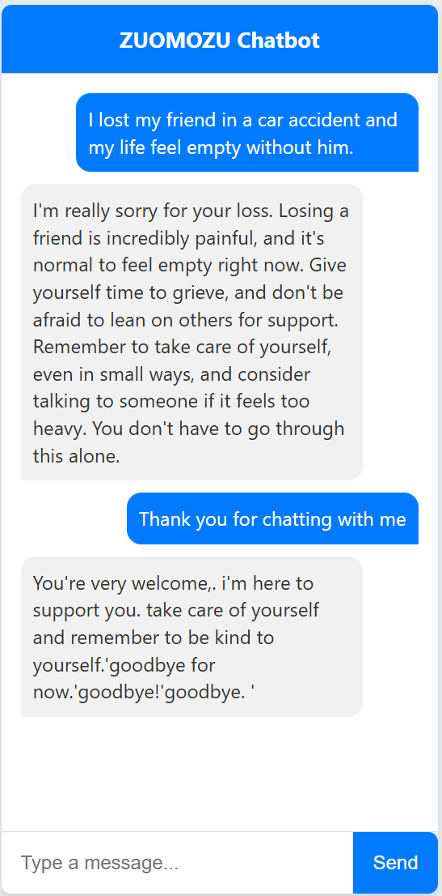

# ZUOMOZU: AI Support for Personal Well-being

# BERT2BERT-Powered AI Chatbot for Enhancing Well-being and Emotional Balance

This project implements a conversational AI chatbot using the BERT2BERT model, fine-tuned on a custom dataset of chat history between humans and AI-psychiatrists. The chatbot is deployed via a Flask web interface for seamless interaction.

## Installation

To set up this project locally, follow the steps below.

1. Clone the repository:
    ```bash
    git clone https://github.com/yourusername/chatbot_project.git
    ```

2. Navigate to the project folder:
    ```bash
    cd chatbot_project
    ```

3. Install the dependencies:
    ```bash
    pip install -r requirements.txt
    ```

4. (Optional) Run the app in Docker:
    ```bash
    docker build -t chatbot .
    docker run -p 5000:5000 chatbot
    ```

5. Start the Flask app:
    ```bash
    python app.py
    ```

The application will be running at `http://localhost:5000/`.


## Usage

Once the application is running, open your browser and navigate to `http://localhost:5000/`. You can start chatting with the bot through the web interface.

Alternatively, to test the model in a script:
```python
from transformers import BertTokenizer, EncoderDecoderModel

tokenizer = BertTokenizer.from_pretrained('model/saved_model')
model = EncoderDecoderModel.from_pretrained('model/saved_model')

response = chat_with_model("I just lost my loved ones, how should I deal with it ", model, tokenizer)
print(response)
```
** The model file is too large, hence it was uploaded in parts, combine it and save it as model.safetensor
## Output


